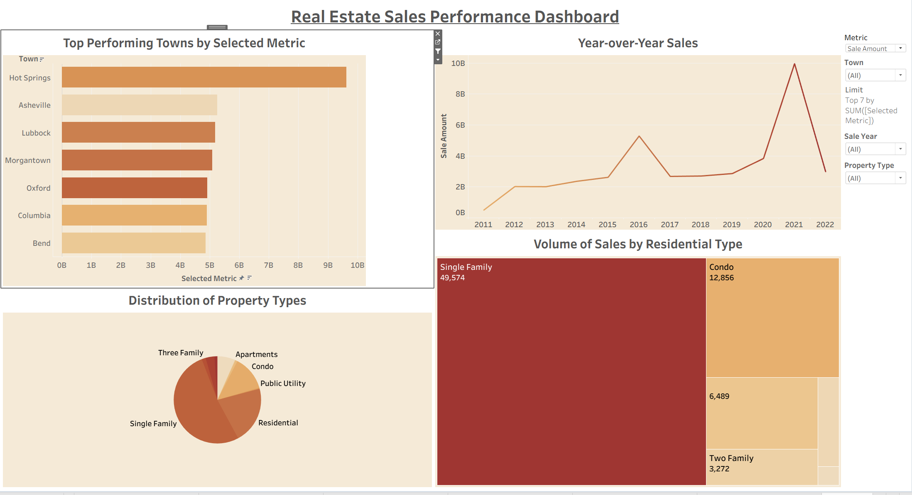
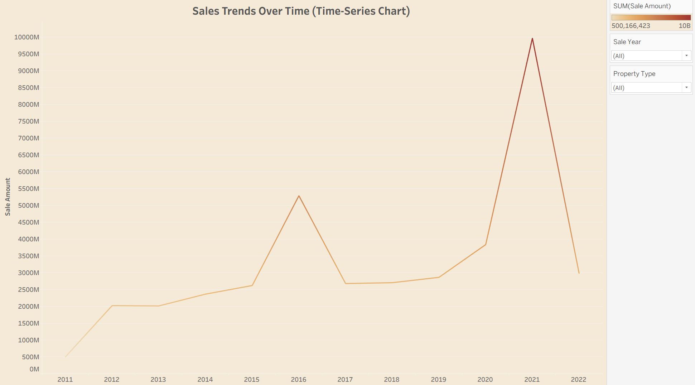
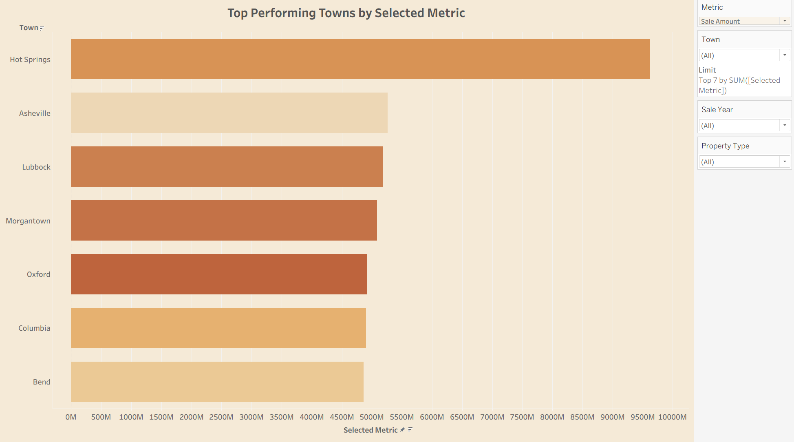
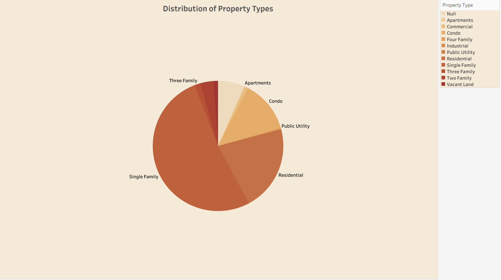
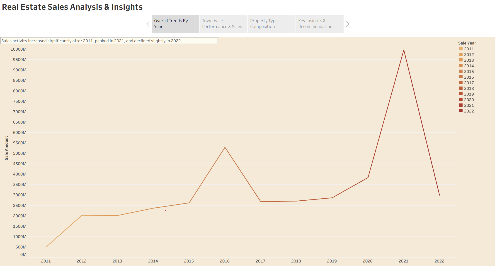

# Real Estate Sales Performance Dashboard | Tableau

## Project Overview

The **Real Estate Sales Performance Dashboard** is an interactive Tableau project designed to analyze historical real estate sales across different towns, property types, and years. The dashboard transforms raw transactional data into meaningful business insights through interactive visualizations, filters, and storytelling, enabling users to explore sales performance and market trends efficiently.

## Business Objective

The primary objective of this project is to analyze real estate sales performance by identifying sales trends, top-performing towns, and property type distribution while providing stakeholders with an interactive dashboard for data-driven decision-making.

---

## Dashboard Preview

### Main Dashboard


### Sales Trends Over Time


### Top Performing Towns


### Property Type Distribution


### Interactive Story View


---

## Tools Used

- Tableau Desktop
- Interactive Dashboard Design
- Data Visualization
- Storytelling
- Dashboard Actions
- Parameters
- Filters
- KPI Reporting

---

## Dashboard Components

The Tableau workbook consists of the following interactive components:

### Sales Trends Over Time
- Visualizes year-over-year sales performance.
- Identifies growth, decline, and seasonal trends.

### Top Performing Towns
- Displays the highest-performing towns based on the selected metric.
- Supports dynamic ranking through parameter selection.

### Property Type Distribution
- Shows the proportion of different residential and commercial property types.

### Sales Volume by Residential Type
- Uses a treemap to compare residential property sales volumes.

### Interactive Filters
Users can analyze the dashboard using filters such as:
- Sale Year
- Town
- Property Type
- Selected Metric

### Story Dashboard
A Tableau Story guides users through multiple analytical views, helping explain key business insights step by step.

---

## Key Features

- Interactive Tableau Dashboard
- Dynamic Filters
- Parameter-Based Analysis
- Story Navigation
- Responsive Dashboard Layout
- KPI Reporting
- Time-Series Analysis
- Treemap Visualization
- Pie Chart Visualization
- Horizontal Bar Chart
- Business Storytelling

---

## Dataset Fields

The dashboard utilizes fields including:

- Sale Amount
- Sale Year
- Town
- Property Type
- Residential Type
- Selected Metric

---

## Repository Contents

```
Real-Estate-Sales-Dashboard.twbx
README.md
dashboard-view.png
sales-trends.png
top-performing-towns.png
property-types.png
story-view.png
```

---

## How to View the Project

1. Download the `.twbx` workbook from this repository.
2. Open it using **Tableau Desktop** or **Tableau Public**.
3. Explore the interactive dashboard using filters and parameters.
4. Navigate through the Tableau Story to understand the analytical insights.

---

## Skills Demonstrated

- Tableau Dashboard Development
- Business Intelligence Reporting
- Interactive Dashboard Design
- Data Visualization
- Data Storytelling
- Dashboard Actions
- Parameter Controls
- Filtering & Interactivity
- Time-Series Analysis
- Sales Performance Analytics

---

## About This Project

This project is part of my Data Analytics portfolio and demonstrates my ability to build interactive Tableau dashboards that transform complex real estate sales data into actionable business insights using modern visualization and storytelling techniques.